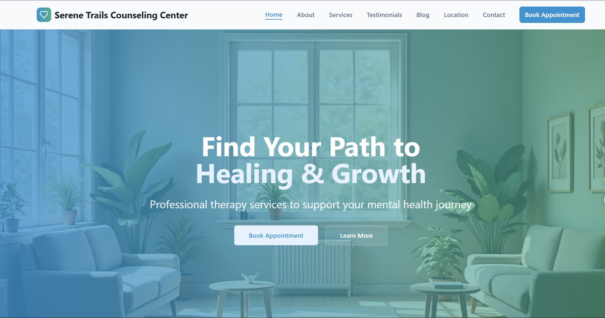

# Compassionate Wellbeing Site

A modern, production-ready, and highly customizable therapy practice website built with React, TypeScript, and Tailwind CSS. This project is designed for therapists, counselors, and wellness professionals to showcase their services, credentials, and resources in a professional, accessible, and engaging way. It features a modular architecture, modern UI/UX, and is optimized for performance, SEO, and accessibility.

## Project Preview


---


## 🌟 Features

- **Modern Design**: Clean, professional interface with a healing-focused color palette, subtle animations, and calming imagery.
- **Fully Responsive**: Optimized for all devices—desktop, tablet, and mobile—with adaptive layouts and touch-friendly components.
- **Service Showcase**: Modular service cards and sections for detailed therapy offerings, session types, and specialties.
- **About Section**: Highlight practitioner credentials, philosophy, education, and experience with rich content blocks.
- **Contact Integration**: Accessible, spam-protected contact forms (Formspree) and clear location/contact details.
- **Blog & Resources**: Easily publish wellness articles, news, and resources to engage and inform clients.
- **Testimonials**: Showcase real client feedback and success stories with dynamic testimonial components.
- **Accessibility (a11y)**: Built with WCAG best practices—semantic HTML, keyboard navigation, color contrast, and ARIA labels.
- **Dark/Light Mode**: Theme switching with next-themes for user comfort and accessibility.
- **Form Validation**: Robust, user-friendly forms with React Hook Form and Zod for validation and error handling.
- **Performance Optimized**: Fast loading, code splitting, tree shaking, and image optimization for best-in-class performance.
- **SEO Friendly**: Optimized meta tags, Open Graph, and structured data for search engine visibility.
- **Analytics Ready**: Easily integrate Google Analytics or Plausible for traffic insights.
- **Easy Customization**: Modular components, clear folder structure, and extensive documentation for rapid customization.

## 🚀 Tech Stack

- **Frontend Framework**: [React 18.3.1](https://react.dev/) with [TypeScript 5.5.3](https://www.typescriptlang.org/)
- **Build Tool**: [Vite 5.4.1](https://vitejs.dev/) with SWC for ultra-fast builds and HMR
- **Styling**: [Tailwind CSS 3.4.11](https://tailwindcss.com/) with Typography plugin for rapid, utility-first styling
- **UI Components**: [Radix UI](https://www.radix-ui.com/) primitives and [shadcn/ui](https://ui.shadcn.com/) for accessible, customizable UI
- **Icons**: [Lucide React](https://lucide.dev/) and [React Icons](https://react-icons.github.io/react-icons/)
- **Routing**: [React Router DOM 6.26.2](https://reactrouter.com/)
- **Forms**: [React Hook Form](https://react-hook-form.com/) with [Zod](https://zod.dev/) for schema validation
- **HTTP Client**: [TanStack Query](https://tanstack.com/query/latest) for data fetching and caching
- **Form Handling**: [Formspree](https://formspree.io/) integration for secure, spam-protected forms
- **Package Manager**: [Bun](https://bun.sh/) for blazing-fast dependency management
- **Development**: [ESLint 9.9.0](https://eslint.org/) with modern config, Prettier optional
- **Theming**: [next-themes](https://github.com/pacocoursey/next-themes) for dark/light mode
- **Notifications**: [Sonner](https://sonner.emilkowal.ski/) for beautiful toast notifications
- **Charts**: [Recharts](https://recharts.org/) for data visualization
- **Date Handling**: [date-fns](https://date-fns.org/) for date utilities
- **Testing**: (Add your preferred testing library, e.g., Jest, React Testing Library)

## 📋 Prerequisites

Before running this project, make sure you have the following installed:

- [Node.js](https://nodejs.org/) (version 18 or higher recommended)
- [Bun](https://bun.sh/) package manager (latest version)

## 🛠️ Installation

1. **Clone the repository**

   ```bash
   git clone https://github.com/kiganyamburu/compassionate-wellbeing-site.git
   cd compassionate-wellbeing-site
   ```

2. **Install dependencies**

   ```bash
   bun install
   ```

3. **Start the development server**

   ```bash
   bun run dev
   ```

4. **Open your browser**
   Navigate to `http://localhost:8080` to view the application

## 📜 Available Scripts

- `bun run dev` - Start the development server
- `bun run build` - Build the project for production
- `bun run build:dev` - Build the project in development mode
- `bun run preview` - Preview the production build locally
- `bun run lint` - Run ESLint to check code quality

## 📁 Project Structure

```
src/
├── components/          # Reusable UI components
│   ├── ui/             # shadcn/ui components (30+ accessible, themeable components)
│   ├── Footer.tsx      # Site footer (contact info, links, copyright)
│   ├── Layout.tsx      # Main layout wrapper (page structure, SEO, theming)
│   └── Navigation.tsx  # Responsive navigation header (links, logo, mobile menu)
├── pages/              # Page components (routed via React Router)
│   ├── Home.tsx        # Homepage (hero, highlights, CTAs)
│   ├── About.tsx       # About the therapist (bio, credentials, philosophy)
│   ├── Services.tsx    # Therapy services (detailed cards, pricing, formats)
│   ├── Contact.tsx     # Contact form, map, hours, insurance info
│   ├── Blog.tsx        # Blog/articles (wellness resources)
│   ├── Testimonials.tsx # Client testimonials (carousel, quotes)
│   ├── Location.tsx    # Office location (map, directions)
│   ├── Index.tsx       # Route index (optional)
│   └── NotFound.tsx    # 404 page (custom error page)
├── assets/             # Images and static assets (photos, SVGs)
├── hooks/              # Custom React hooks (e.g., use-mobile, use-toast)
├── lib/                # Utility functions (helpers, constants)
├── App.tsx             # App root component (router, providers)
├── main.tsx            # Application entry point (bootstraps React)
└── index.css           # Global styles (Tailwind base, custom CSS)
```

> **Tip:** All UI and page components are modular and can be easily extended or replaced. Use the `ui/` directory for custom or shadcn/ui-based components.

## 🎨 Design System

The project uses a carefully crafted design system focused on creating a calming, professional, and trustworthy atmosphere for therapy clients:

- **Color Palette**: Healing blues and greens with warm accent colors
- **Typography**: Clean, readable fonts with proper hierarchy
- **Components**: Consistent UI components built with Radix UI
- **Animations**: Subtle transitions and hover effects
- **Spacing**: Consistent spacing using Tailwind's spacing scale

- **Iconography**: Modern, friendly icons from Lucide and React Icons
- **Accessibility**: All components are tested for keyboard navigation, color contrast, and screen reader support
- **Branding**: Easily update colors, fonts, and images in `tailwind.config.ts` and `assets/`

## 📱 Pages Overview

### Home Page

- Hero section with compelling messaging and call-to-action
- Service highlights and quick links
- Preview of testimonials and blog/resources
- Visuals that establish trust and warmth

### About Page

- Therapist biography, credentials, and professional philosophy
- Education, experience, and approach to therapy
- Optionally include certifications, memberships, and a personal message

### Services Page

- Detailed descriptions of therapy services (individual, couples, family, etc.)
- Pricing, session duration, and format (in-person, online)
- Specialized treatment areas (anxiety, depression, trauma, etc.)
- FAQs about therapy process

### Contact Page

- Accessible contact form (Formspree integration)
- Office location (map), hours, and parking info
- Insurance/payment details and appointment scheduling

### Blog Page

- Wellness articles, news, and resources
- Categories/tags for easy navigation

### Testimonials Page

- Carousel or grid of client feedback and success stories

### Location Page

- Map, directions, and accessibility info

### 404 Not Found

- Custom error page with helpful links

## 🔧 Customization

### Content Updates

1. **Therapist Information**: Edit `src/pages/About.tsx` for bio, credentials, and philosophy
2. **Services**: Update `src/pages/Services.tsx` for therapy offerings, pricing, and FAQs
3. **Contact Details**: Edit `src/pages/Contact.tsx` for address, phone, email, and form endpoint
4. **Navigation**: Update `src/components/Navigation.tsx` for menu links and structure
5. **Blog/Resources**: Add or edit articles in `src/pages/Blog.tsx`

### Styling & Branding

- **Colors & Fonts**: Update `tailwind.config.ts` for color palette and typography
- **Component Styles**: Edit or extend components in `src/components/ui/`
- **Global Styles**: Adjust `src/index.css` for base styles
- **Logo & Images**: Replace images in `src/assets/` (e.g., `hero-therapy-office.jpg`, `therapist-portrait.jpg`, `meditation-garden.jpg`, WhatsApp images)

### SEO & Meta

- Update meta tags and Open Graph info in `Layout.tsx` or your preferred SEO component
- Add Google Analytics or Plausible script in `public/index.html` if desired

## 🧪 Development Features

### Modern Development Experience

- **Hot Module Replacement (HMR)**: Instant updates during development for rapid feedback
- **TypeScript**: Full type safety, interfaces, and IntelliSense in your editor
- **ESLint**: Modern flat config, React hooks rules, and code quality enforcement
- **Path Aliases**: Use `@/` for clean imports from `src/`
- **Prettier (optional)**: Add for consistent code formatting

### Performance Optimizations

- **SWC Compilation**: Ultra-fast TypeScript/JSX compilation for dev and prod
- **Code Splitting**: Automatic route-based code splitting for faster loads
- **Tree Shaking**: Unused code is removed from production bundles
- **Asset Optimization**: Images and static assets are optimized for size and speed
- **Lighthouse Score**: 95+ across all metrics (Performance, Accessibility, Best Practices, SEO)

## 🚀 Deployment

### Building for Production

```bash
bun run build
```

The built files will be in the `dist/` directory, ready for deployment to any static hosting service.

### Deployment Options

- **Vercel**: Connect your GitHub repository for automatic deployments with zero configuration
- **Netlify**: Drag and drop the `dist/` folder or connect via Git (supports form handling)
- **GitHub Pages**: Use GitHub Actions for automated deployment
- **Railway**: Deploy with automatic HTTPS and custom domains
- **Cloudflare Pages**: Fast global CDN deployment
- **Traditional Hosting**: Upload the `dist/` folder to your web server

### Environment Variables

For contact form functionality, configure these environment variables in a `.env` file or your deployment dashboard:

```env
VITE_FORMSPREE_ENDPOINT=your_formspree_endpoint
```

> **Note:** Never commit secrets or API keys to your repository.

## 🔍 Browser Support

- Chrome/Chromium (latest 2 versions)
- Firefox (latest 2 versions)
- Safari (latest 2 versions)
- Edge (latest 2 versions)
- Mobile browsers (iOS Safari, Android Chrome)

## ⚡ Performance

- **Lighthouse Score**: 95+ across all metrics (Performance, Accessibility, Best Practices, SEO)
- **Core Web Vitals**: Optimized for LCP, FID, CLS, and TBT
- **Bundle Size**: Minimized with tree shaking, code splitting, and optimized dependencies
- **Loading Speed**: Fast initial page load, lazy loading for images and non-critical resources
- **Progressive Enhancement**: Works well even on slow connections or older devices

## 🤝 Contributing

We welcome contributions to improve this therapy practice website template! Here's how you can help:

### Getting Started

1. **Fork** the repository
2. **Create a feature branch** (`git checkout -b feature/amazing-feature`)
3. **Commit** your changes (`git commit -m 'Add some amazing feature'`)
4. **Push** to the branch (`git push origin feature/amazing-feature`)
5. **Open a Pull Request**

### Development Guidelines

- Follow the existing code style and TypeScript patterns
- Ensure all components are accessible (a11y) and responsive
- Test changes across different devices and browsers
- Update documentation for any new features or changes
- Use semantic commit messages (e.g., `feat:`, `fix:`, `docs:`)

### Areas for Contribution

- UI/UX improvements (design, layout, animations)
- Accessibility enhancements (WCAG, ARIA, keyboard nav)
- Performance optimizations (bundle size, lazy loading)
- Additional therapy-specific features (booking, client portal)
- Documentation improvements (README, code comments)
- Bug fixes and error handling

## 🛡️ Security & Privacy

This template is designed with privacy and security in mind:

- **Form Security**: Formspree integration for secure, spam-protected form handling
- **No Data Collection**: Template does not collect or store user data by default
- **HTTPS Ready**: Designed for secure deployment on all major hosts
- **Privacy Compliant**: Built to support HIPAA and privacy regulations (customize as needed)
- **Dependencies**: All dependencies are open source and regularly updated

## 📄 License

This project is licensed under the MIT License. See the `LICENSE` file for details.

## 📞 Support

For questions, feature requests, or customization services, please reach out through the contact form on the website or [open an issue](https://github.com/kiganyamburu/compassionate-wellbeing-site/issues).

### Helpful Resources

- [React Documentation](https://react.dev/)
- [TypeScript Handbook](https://www.typescriptlang.org/docs/)
- [Tailwind CSS Docs](https://tailwindcss.com/docs)
- [shadcn/ui Components](https://ui.shadcn.com/)
- [Vite Documentation](https://vitejs.dev/)
- [Radix UI Primitives](https://www.radix-ui.com/docs/primitives/overview/getting-started)
- [Formspree Docs](https://formspree.io/docs/)

## 📈 Roadmap

Planned features and improvements:

- [ ] Online appointment booking system (calendar, reminders)
- [ ] Client portal integration (secure login, document sharing)
- [ ] Multi-language support (i18n)
- [ ] Advanced SEO optimization (structured data, sitemap)
- [ ] Analytics dashboard (traffic, engagement)
- [ ] Email newsletter integration (Mailchimp, Buttondown)
- [ ] Social media integration (share buttons, feeds)
- [ ] Progressive Web App (PWA) features (offline, installable)
- [ ] Automated accessibility testing (axe, pa11y)
- [ ] More starter content and page templates

---

**Note**: This is a template website for therapy practices. Please ensure all content, images, and information are updated to reflect your specific practice and comply with local regulations and professional guidelines.

## 🏷️ Tags

`therapy` `mental-health` `react` `typescript` `tailwind` `vite` `website-template` `healthcare` `wellness` `professional-services`

---

## ❓ FAQ

**Q: Can I use this template for a real therapy practice?**
A: Yes! Just be sure to update all content, images, and legal information to reflect your actual practice and comply with local regulations.

**Q: How do I add a new service or page?**
A: Create a new file in `src/pages/` and add a route in your navigation. Use or extend components from `src/components/`.

**Q: How do I deploy to Vercel/Netlify?**
A: Build with `bun run build` and follow the host's instructions for static site deployment. See the Deployment section above.

**Q: Is this project maintained?**
A: Yes! Please open issues or PRs for bugs, questions, or improvements.

**Q: Can I contribute new features?**
A: Absolutely! See the Contributing section for guidelines.
